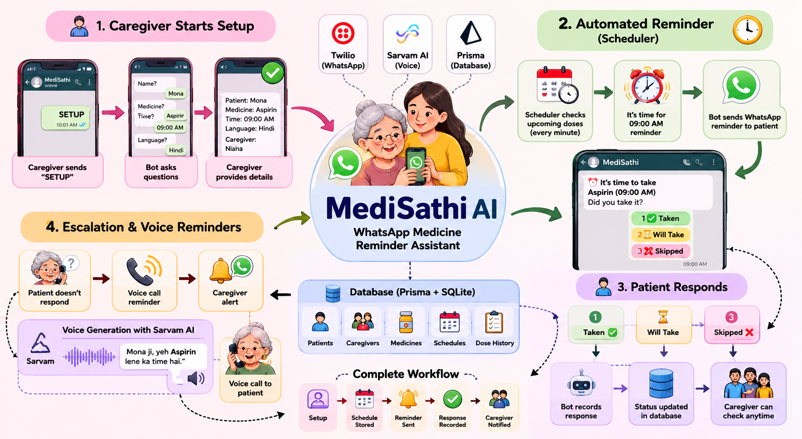

# 🎤 MediSathi AI

MediSathi AI is a multilingual WhatsApp-based medicine reminder assistant designed for elderly users and Indian families.

The system helps caregivers manage medicine schedules while allowing patients to receive reminders directly on WhatsApp in their preferred language.

---

# 🚀 Features

* 💬 WhatsApp medicine reminders
* 🌍 Multilingual support

  * Hindi
  * English
  * Tamil
  * Telugu
  * Bengali
  * Marathi
* 🎙 Voice-note interaction using Sarvam AI STT
* 🔊 AI voice reminder calls using Sarvam TTS + Twilio
* 👨‍👩‍👧 Caregiver and patient workflow
* ⏰ Automated medicine scheduler
* 📊 Dose tracking and status updates

---

# 🛠 Tech Stack

* Node.js
* TypeScript
* Fastify
* Prisma ORM
* SQLite
* Twilio WhatsApp API
* Twilio Voice API
* Sarvam AI APIs
* ngrok

---

# 🧠 How It Works

1. Caregiver sets up medicine schedule on WhatsApp
2. Patient receives reminders automatically
3. Patient can:

   * type response
   * send voice note
   * respond in native language
4. Sarvam STT converts voice → text
5. System updates medicine status
6. Caregiver can track medicine activity

---

# 🖼 Workflow

---

# 🎥 Demo Video

[Watch Demo Video Here](https://drive.google.com/file/d/1nyrJ25D4nPajaFN8aJZdMuEIv6E1J891/view?usp=drivesdk)

---

# 📱 Example Commands

* SETUP
* STATUS
* PAUSE
* RESUME

---

# 🚀 Future Improvements

* AI health insights
* Missed-dose escalation system
* Family dashboard
* Smart medicine analytics

---

# 👩‍💻 Built By

Naina Modi
